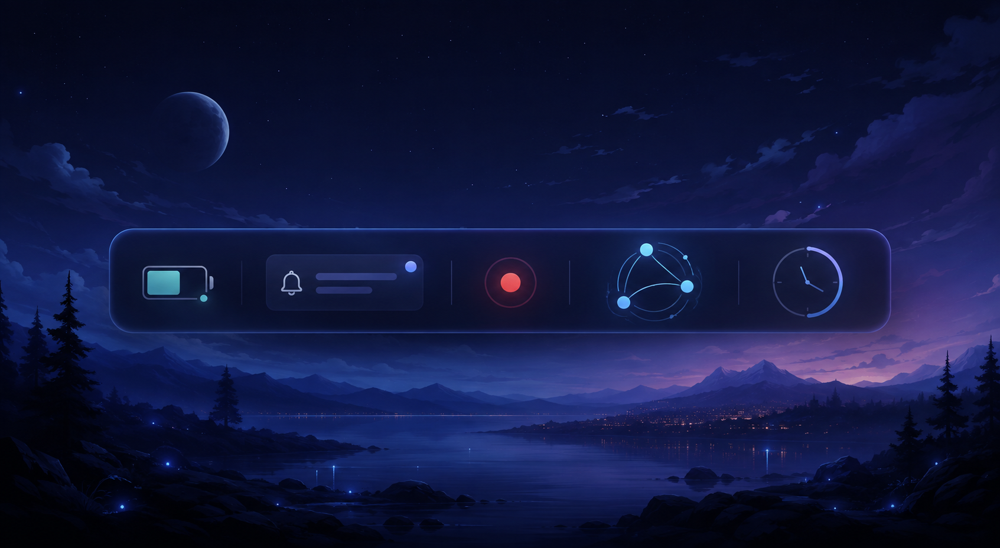
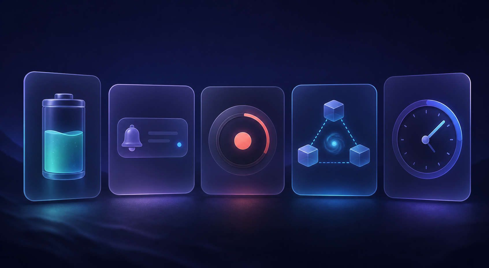

# Noctalia plugins



Personal [Noctalia](https://github.com/noctalia-dev/noctalia) plugins by
[@pschmitt](https://github.com/pschmitt), packaged as a Nix flake.

## Plugins

| Plugin | Description |
| --- | --- |
| [`pschmitt/battery-icon`](./plugins/battery-icon) | Android-inspired battery indicator with percentage, charging state, and optional sounds. |
| [`pschmitt/osd`](./plugins/osd) | Scriptable, ad-hoc OSD/toast panels. |
| [`pschmitt/screencast`](./plugins/screencast) | Red `REC` indicator while a portal screencast is active. |
| [`pschmitt/syncthing`](./plugins/syncthing) | Syncthing status, controls, launcher provider, shortcut, and desktop widget. |
| [`pschmitt/timewarrior`](./plugins/timewarrior) | Current Timewarrior task duration and detail panel. |



## Nix usage

Add the flake input and make it follow your existing `nixpkgs`:

```nix
noctalia-plugins = {
  url = "github:pschmitt/noctalia-plugins";
  inputs.nixpkgs.follows = "nixpkgs";
};
```

The flake exposes the individual packages under
`packages.${system}.noctalia-<name>`. Point Noctalia plugin sources at the
package's `share/noctalia-plugins` directory, for example:

```nix
let
  noctaliaPlugins = inputs.noctalia-plugins.packages.${pkgs.stdenv.hostPlatform.system};
in
{
  programs.noctalia.settings.plugins.source = [
    {
      name = "pschmitt-syncthing";
      kind = "path";
      location = "${noctaliaPlugins.noctalia-syncthing}/share/noctalia-plugins";
      enabled = true;
    }
  ];
}
```

### Timewarrior requirement

`pschmitt/timewarrior` requires the `timew` executable from
[Timewarrior](https://timewarrior.net/) on Noctalia's service `PATH`. Its
manifest declares that CLI requirement, and the plugin calls `timew export`
directly through Noctalia's argument-array API. It parses the JSON export with
`noctalia.json`, so it has no jq dependency and no companion Nix helper.

For Nix/Home Manager, install `pkgs.timewarrior` for the user running
Noctalia.

## License and attribution

This repository is licensed under GPL-3.0-or-later; see [LICENSE](./LICENSE).

`plugins/syncthing` is a fork of Marco Ziliani's `rylos/syncthing` plugin from
[noctalia-dev/community-plugins](https://github.com/noctalia-dev/community-plugins/tree/main/syncthing).
Its upstream `plugin.toml` declares the code MIT-licensed. The original MIT
notice is retained in [LICENSES/MIT.txt](./LICENSES/MIT.txt) and the fork's
[NOTICE](./plugins/syncthing/NOTICE). The GPL applies to this collection and
its pschmitt-authored changes without removing the upstream MIT permissions.

The other plugins are original ports or implementations maintained here. See
individual plugin manifests for their runtime dependencies and metadata.
