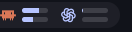
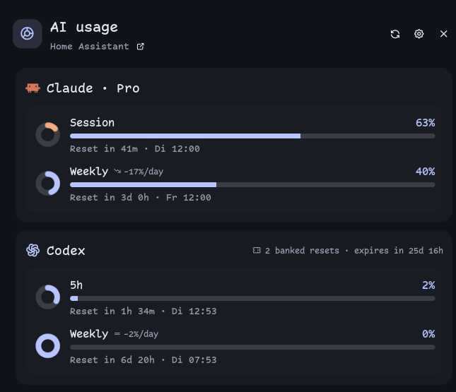

# Home Assistant AI Usage

Home Assistant-backed AI plan usage for the Noctalia bar and an attached detail panel. It reads the quota entities that Home Assistant already collects, so the desktop does not need separate provider CLIs, OAuth stores, or direct API calls.

| Bar | Panel |
| --- | --- |
|  |  |

## Discovery

The plugin first reads Home Assistant's integration registry and recognises loaded instances of Claude Usage, OpenAI Usage Monitor (Codex), GitHub Copilot Usage, and Gemini Usage. It then asks Home Assistant only for the correct active metrics for those integrations; it never downloads the complete state registry. Disabled integrations and unavailable entities are ignored automatically.

There is no user-maintained provider or sensor list. Each supported integration has its own appropriate metric and reset handling, while labels and icons come directly from Home Assistant. Codex's manually redeemable rate-limit resets ("banked resets") are also surfaced on its panel card when the underlying entity reports any as available, along with the soonest expiry.

## Usage

Add `pschmitt/ha-ai-usage:bar` to a Noctalia bar. Left click opens the attached panel; right click refreshes Home Assistant data immediately. Set **Bar: Display mode** to **Icon(s) only** for the requested compact mode: the bar shows only discovered metric icons while retaining the tooltip, refresh action, and full detail panel.

Settings are prefixed by what they affect -- **Connection:** (server/token/refresh), **Bar:** (bar-widget-only), **Panel:** (popup-panel-only), or **Shared:** (both) -- so it's clear at a glance which surface a given toggle changes.

`server_file` and `token_file` point to files containing the Home Assistant URL and a long-lived access token. They are read only at request time and are supplied by sops-nix runtime secret files here.

The panel header's link icon opens `server_file`'s URL plus **Panel: Home Assistant link path** (default `/`) in the desktop's default browser — point it at a dashboard, e.g. `/mi-casa/data#ai-quotas`.

Enable **Panel: Compact mode** to fit more providers in the same panel height: smaller rings, tighter card padding/spacing/fonts -- pace, the relative reset countdown, and the absolute reset time all stay. Disable **Panel: Show all metrics** to drop each card down to just its headline session/weekly windows (or its promoted primary quota for a category-only provider like Copilot), hiding Copilot's Chat/Completions rows and Gemini's 3P model rows.

**Panel: Cards** works like **Bar: Cards** -- the same comma-separated, case-insensitive account-fragment matching -- but independently filters and orders the popup panel instead of the bar, and defaults to empty (every card, unreordered). Order matters: `Codex, Pro` puts the Codex card first even though the panel's own provider-then-label sort would otherwise put a Claude Pro card ahead of it.

Set **Bar: Quota window** to **Both (stacked)** to show the 5h/session and weekly bars together, one above the other, instead of picking a single window. A card with only category quotas (Copilot) still shows one bar, not the same number duplicated twice.

The default bar is deliberately compact: glyphs plus progress bars, with values and labels kept in the tooltip and panel. The tooltip is the at-a-glance view and ignores **Bar: Cards**, **Bar: Metric limit** and **Bar: Quota window** entirely: it lists every discovered account with one short line per headline quota (`Weekly 21%`) — an account's own session/weekly windows only, never Gemini's 3P side quotas or Copilot's per-category counters, and falling back to the primary quota for providers that expose no time window at all. Lines are kept narrow on purpose — the tooltip ellipsizes wide values — so reset times stay in the panel.

What the bar shows is configured plugin-wide (Settings -> Plugins -> Home Assistant AI Usage), not per bar instance: **Bar: Quota window** picks 5h/session, weekly or both, **Bar: Cards** filters which discovered accounts appear, and **Bar: Metric limit**, **Bar: Display mode**, names, percentages, reset text, and used-versus-remaining labels round it out. Only the bar's pixel geometry (**Bar: Icon size**, progress width/height, spacing) stays a per-widget setting. That split is deliberate: on a declaratively managed Noctalia these keys must be settable from `plugin_settings."pschmitt/ha-ai-usage"`, which per-widget settings are not.

Reset times support relative countdowns and three configurable local-date formats.

## Panel size

Noctalia panels have a fixed outer height -- there is no runtime panel-resize
API -- so **Panel: Size** picks between four preset panel geometries
(`panel-small`/`panel`/`panel-large`/`panel-xlarge`, 700-1900px tall) rather
than resizing one panel dynamically. **Automatic** (the default) estimates
the right preset from the accounts and metrics Home Assistant currently
reports, combined with **Panel: Compact mode** and **Panel: Show all
metrics** -- a single lightly used account gets the small preset, a busy
multi-provider account with every metric shown gets a larger one. Pick a
fixed size instead if you'd rather the panel never change geometry as
accounts come and go.

Because the panel id is only resolved at click time, left-click is handled by
the bar widget's own script rather than Noctalia's anchored panel-toggle
action, so the panel opens centered rather than anchored under the click.

## Network and privacy

One authenticated `POST /api/template` request runs at the configured refresh interval (60 seconds by default). Home Assistant filters the active metric set server-side before returning it, and no provider endpoint is contacted from the desktop. The data remains in Noctalia's in-memory plugin state and is not written to disk.

## IPC

```sh
noctalia msg plugin pschmitt/ha-ai-usage:poller all refresh
```

## The reset-countdown rings

Noctalia's Luau UI has no circular progress control, so each card's countdown
ring is an image. It is an SVG — two stroked circles and a dash offset —
written by `ring.luau` into the plugin's data dir and handed to `ui.image` as a
path. Files are namespaced by the build's output hash and bucketed to 2% of the
window, and stale generations are pruned on load.

It used to be a PNG drawn by ImageMagick, which was the wrong tool twice over.
The shape is parametric, so rasterising it needed a filled wedge, an inner
circle punched out with `DstOut` and two hand-placed discs to fake what
`stroke-linecap="round"` says in a word. Worse, a subprocess is asynchronous:
the panel asked for a ring, got nothing that frame, and drew a placeholder
glyph. Since the file a row needs drifts with time (a 5h window changes bucket
every ~6 minutes), a panel opened and dismissed within a second routinely
showed placeholders instead of rings. `noctalia.writeFile` is synchronous, so
the path now exists before the render that needs it, and the plugin needs no
ImageMagick at all.
