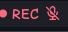
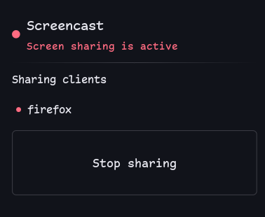

# Screencast Indicator

`pschmitt/screencast` displays a red, breathing `REC` marker in a Noctalia
bar while a portal-based screen share is live. Its tooltip names the PipeWire
client(s) attached to the portal stream.

| Bar (while sharing) | Panel |
| --- | --- |
|  |  |

The bar widget renders nothing at all (`barWidget.setVisible(false)`) when no
portal capture is active -- there's no idle icon to screenshot.

## Detection

The plugin queries PipeWire itself and inspects the graph for links to
`xdg-desktop-portal` nodes. It uses the compact `pw-cli` node and link listings
instead of decoding the complete `pw-dump` JSON graph. The package substitutes
an absolute `pw-cli` path, so it has no `jq` dependency and does not require a
separately managed `busctl` watcher or a shared state file.

This naturally relies on the PipeWire session and a portal backend—the same
stack used by browser and portal-aware application screen sharing. It reports
portal captures, not arbitrary recorder processes that bypass the portal.

## Panel

Click the active `pschmitt/screencast:bar` widget to open a small details
panel. It lists the PipeWire clients attached to the share, each with a
best-effort icon guessed from the client's PipeWire node name (Firefox,
Chrome/Chromium, Discord, Slack, Zoom, Teams, Telegram, WhatsApp, Skype,
Spotify, Steam, VLC, VS Code fall back to their own glyph; anything else gets
a plain window icon). Clicking a client asks Hyprland for its own window list
and focuses the first match on class or title -- silently a no-op on another
compositor, if `hyprctl` is missing, or if nothing matches.

The `Stop sharing` button removes the share's PipeWire links directly; it
does not depend on the application that created the portal session or on a
separate watcher service.

## Setup

Enable `pschmitt/screencast`, then add `pschmitt/screencast:bar` to a bar.
The plugin is hidden when idle. Its settings control poll frequency, the
label (shown/hidden, and its text), colors, dot size, and pulse animation
(including turning it off for a static dot).
