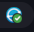
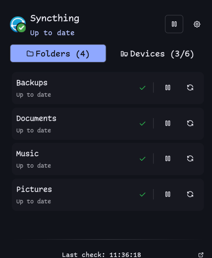

# Syncthing

`pschmitt/syncthing` is a presentation-focused fork of Marco Ziliani's
[`rylos/syncthing`](https://github.com/noctalia-dev/community-plugins/tree/main/syncthing)
plugin. It retains the upstream service, panel, launcher, shortcut, and
desktop widget while using a larger tray-like icon and composited status
badges in the bar. The panel has folder and device lists with dedicated
detail pages: folder pages show status counters, pending files, recent errors,
recent local/remote changes, recent conflict filenames, and an action to open
the folder in the default file manager; device pages show connection details
and the folders shared with that device.
Device pages also expose the full device ID, a one-click clipboard copy
action, and a QR code for pairing another Syncthing instance.

| Bar | Panel |
| --- | --- |
|  |  |

## Setup

Install and run Syncthing for the same user as Noctalia, enable
`pschmitt/syncthing`, then open its settings. Enter the Syncthing GUI URL
(normally `http://127.0.0.1:8384`) and API key; select folders to show when
needed. The plugin can also read a Syncthing configuration file to discover
connection details.

The manifest declares the runtime commands it uses: `syncthing`, `gio`, and
`xdg-open`. The Nix package supplies the plugin itself; install those commands
through your normal desktop configuration.

## Row indicators

The panel's folder and device rows carry the same status indicators
Syncthing's own web GUI puts at the right edge of a row: a check when a folder
is up to date, a magnifier while scanning, an hourglass while preparing to
sync, sync arrows while syncing, a recycle glyph while cleaning versions, a
pause glyph when paused or queued, and a warning triangle on error. Device
rows pair that state glyph with the web GUI's connection-type meter — one bar
for a relay hop, three for a direct WAN connection, five for a direct local
one, and a struck-through meter when the device is not connected.

Use the chevron at the end of a folder or device row to open its detail page.
Folder details are loaded on demand because Syncthing's pending-file, folder
error, and event endpoints are relatively expensive compared with the regular
status poll.

Nothing is vendored from Syncthing for this: the web GUI draws Font Awesome
glyphs, and Noctalia ships the full [Tabler](https://tabler.io/icons) icon
font, which has a direct equivalent for each of them. The only bundled art is
`assets/status-*.svg`, the composited Syncthing-logo status badges this fork
already carried. See [NOTICE](./NOTICE) for their terms.

## Attribution

The upstream code is MIT-licensed. See [NOTICE](./NOTICE) and the repository's
[MIT notice](../../LICENSES/MIT.txt) for attribution and terms.
